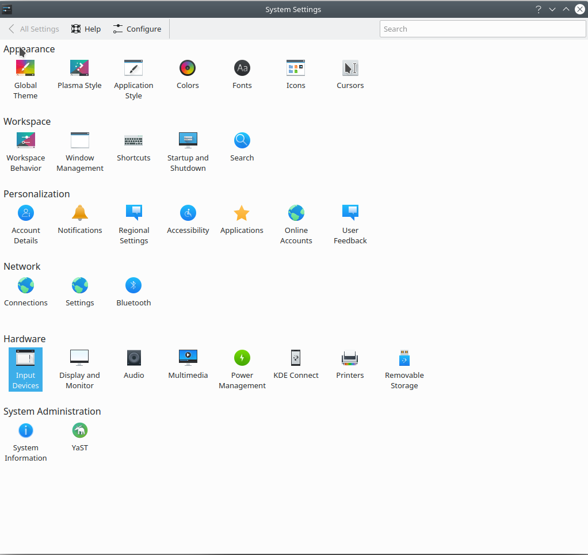
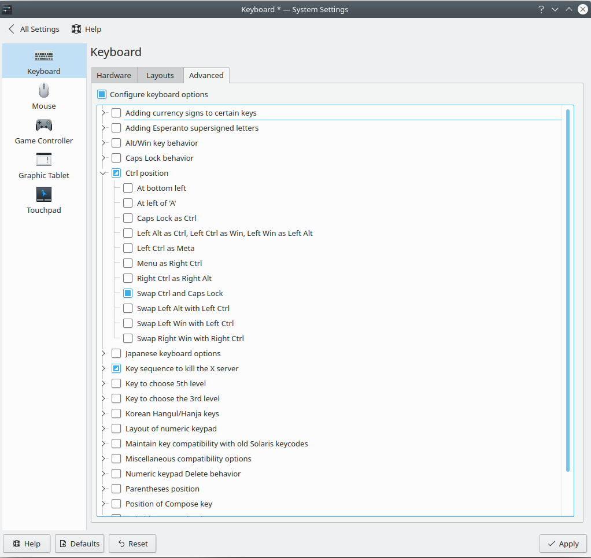

# OpenSUSE Configurations

### This is my openSUSE configuration in mefe9 which is the my main work computer.

- tmux
- nvim
- csh
- mc
----

Now I swap the `CapsLock` with `ctrl` in global setting, you need to change it in the **keyboard setting** of your PC in advance. You can do the same thing in Mac.  

For my computer (mefe9):  

